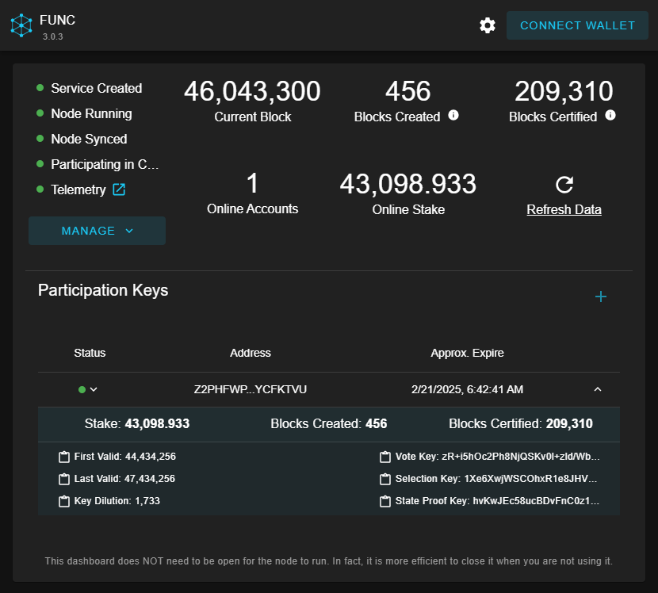

#  Funk's Ultimate Node Controller (FUNC)

FUNC is a Cross-platform Service that makes it easy to spin up a node for Algorand or Voi and start participating in consensus.



## Installation

Head over to the [releases page](https://github.com/GalaxyPay/func/releases) and download the install file for your OS.

The installer does not include the node software. It is automatically downloaded from [this open-source repo](https://github.com/GalaxyPay/go-algo-win) (Windows) or [the official Algorand repo](https://github.com/algorand/go-algorand) (Mac/Linux) the first time you open the app. This separation allows the node software to be updated without needing to update this app.

The app is a [locally hosted webpage](http://localhost:3536). After install, bookmark it for easy access.

### Windows

In order to run it, you'll need to click "More info" on the "Windows protected your PC" dialog.
Then click the "Run Anyway" button.
The code is open-source so you can review it yourself or have a trusted friend do so.

When updating a previous installation, the installer will recommend to let it automatically close applications and restart them after install. You should allow it to do this.

### MacOS

After downloading the `.pkg` file to your machine, run

```sh
sudo installer -target / -pkg func_<version>_darwin-<architecture>.pkg
```

If instead you wish to install the package by double-clicking the `.pkg` file , you will have to follow [these instuctions](https://support.apple.com/guide/mac-help/apple-cant-check-app-for-malicious-software-mchleab3a043/mac) for bypassing unsigned packages:

1. On your Mac, choose Apple menu > System Settings, then click Privacy & Security in the sidebar. (You may need to scroll down.)
2. Go to Security, then click Open.
3. Click Open Anyway. (This button is available for about an hour after you try to open the app.)
4. Enter your login password, then click OK.

### Linux

After downloading the `.deb` file to your machine, run

```sh
sudo dpkg -i func_<version>_linux-<architecture>.deb
```

Then visit the locally hosted webpage at <http://localhost:3536> (for remote access see notes below)

## Uninstall

The app is a **Node Service Manager** - uninstalling it will **_not_** remove node services that you create with it. If you wish to remove everything, use the app to Remove Services and even Delete Node Data before uninstalling the app.

## Manage Node Menu Options

### Create Service

- Creates and starts a new Service to run the Node
- Only available when Service does not exist

### Start Node

- Starts Service that runs the Node
- Only available when Node is stopped

### Stop Node

- Stops Service that runs the Node
- Only available when Node is running

### Remove Service

- Removes Service that runs the Node
- Only available when Node is stopped

### Configure

- Change your node's Port, DNS Bootstrap, and P2P settings

### Enable/Disable Telemetry

- Link your node to [Nodely Telemetry Service](https://nodely.io/docs/telemetry/quickstart/)
- Once enabled, you'll get a link to your node's dashboard on Nodely
- Only available on Algorand network when Node is running

### Node Data Directory

- Configure the directory for your node data
- You will need write permission to the new path
- Only available when Service does not exist

### Delete Node Data

- Deletes all node data, including any participation and KMD keys
- Only available when Service does not exist

## Participating in Consensus

If you want to participate in consensus, you'll need to generate a Participation Key for your account and register that key with account to bring it "online".

[Read more about how Participation Keys function in the Algorand Consensus Protocol](https://developer.algorand.org/docs/get-details/algorand_consensus/#participation-keys)

Here's how to do it:

1. Wait for your node to sync.
2. Connect your wallet.
3. Click the + icon in the Participation Keys section.
4. Click Generate and wait. It takes a few minutes for your node to generate the Participation Key.
5. Once the key is generated, click on the Status dot to Register the key.
6. Your account should now be Online, and your Participating in Consensus light should be green.

## Notes

- The app is a locally hosted webpage, <http://localhost:3536>. After install, bookmark it for easy access.

- The node will restart automatically if your computer reboots, but you will need to configure your computer to **_not_** go into Sleep mode in order to keep the node running 24/7.

- If you Stop a node and restart your computer, the node will restart automatically. You must remove the service if you want the node to not restart. Removing the service preserves the node data; deleting the data is a separate step.

### Remote Access (Advanced)

- If you want to access the site from another computer on your network, you will need to open the following ports:

  - 3536 AND 3537 - FUNC UI and API
  - 8081 - Algorand algod
  - 8082 - Voi algod

- The `algod` ports are configurable through the UI, and you only need to open the ones for the networks you use

- This should **ONLY** be done on a local network - **DO NOT** open these ports to the internet

- If you want to be able to use WalletConnect wallets (e.g. Defly, Pera) while accessing the site via IP, you'll need to use port 3537 which serves the site with a self-signed cert over HTTPS. You'll also need "Allow Insecure Content" for the site in your browser settings so that it can communicate to your node over HTTP.

## Build (for Developers)

You can fork the repo and let Github Actions do the build for you, or you can run:

- [LocalPublish.ps1](LocalPublish.ps1) (Windows)
- [local-publish.sh](local-publish.sh) and [create-package-pkg.sh](create-package-pkg.sh) (Mac)
- [local-publish.sh](local-publish.sh) and [create-package-deb.sh](create-package-deb.sh) (Linux)

Dependencies include .NET Core 8, Node.js, pnpm, and Inno Setup.
